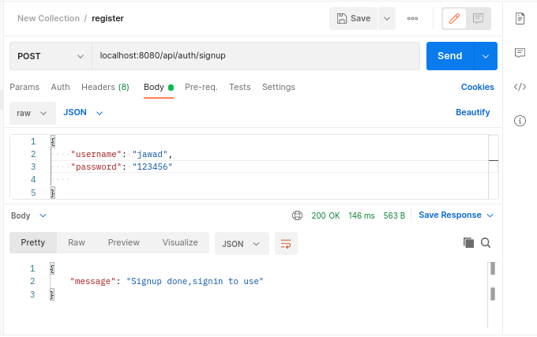
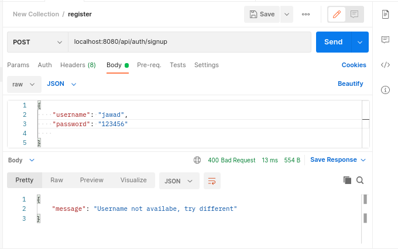
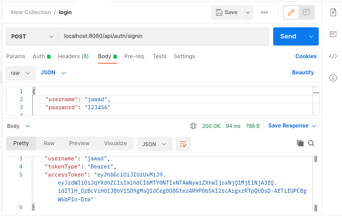
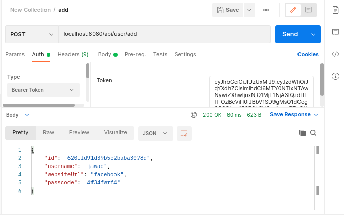
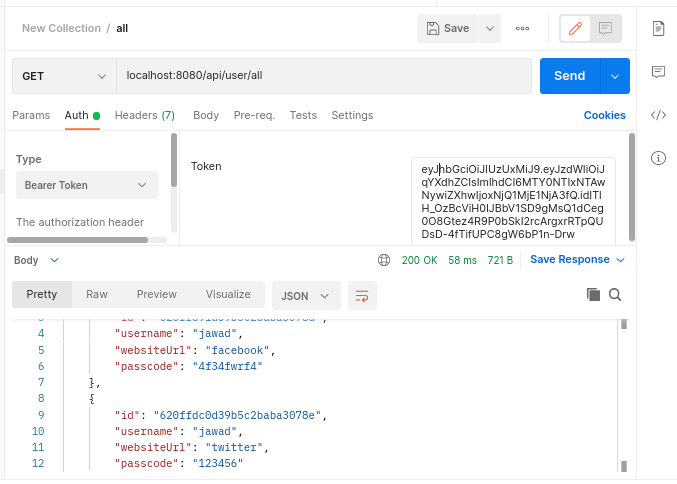
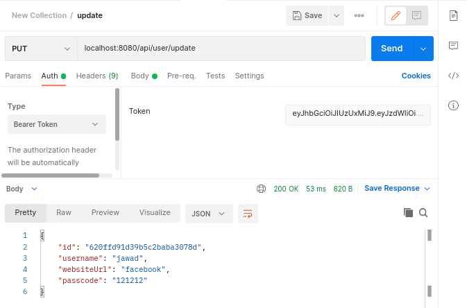
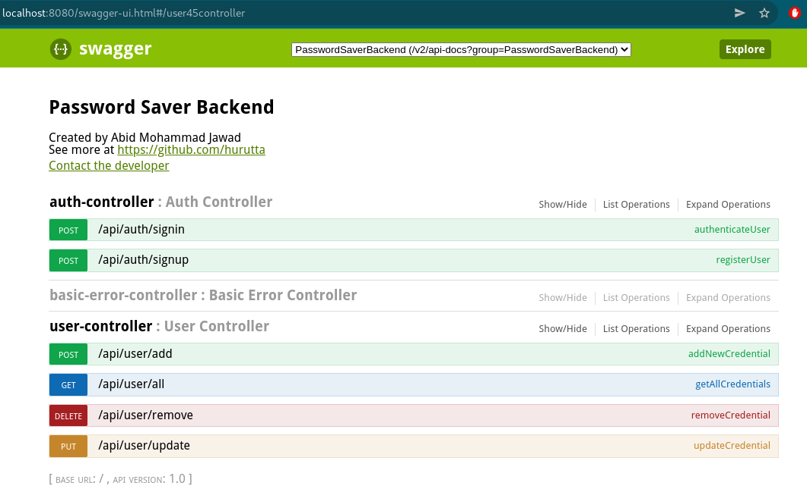
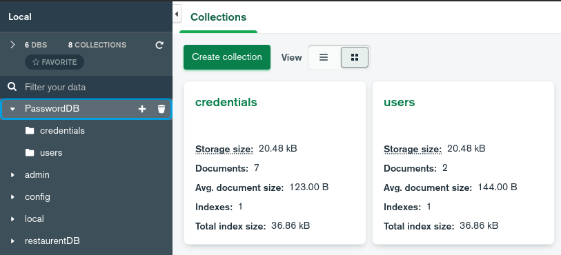

# PasswordSaver Backend 
  
Its a Maven based **SpringBoot** backend project for saving credentials for multiple users integrated with **Swagger** , tested with **Junit**. **MongoDB** is used for database.
  

<!-- TABLE OF CONTENTS -->

## Table of Contents

  <ol>
    <li>
      <a href="#about2">About The Project</a>
      <ul>
        <li><a href="#build3">Structure</a></li>
      </ul>
    </li>
    <li><a href="#usage2">Usage</a></li>
    <li><a href="#contact2">Contact</a></li>
  </ol>

<!-- ABOUT THE PROJECT -->

## About The Project

In this project, I created a backend Springboot project for Password saving tool application. It offers all the CRUD operations and return necessary JSON feedback. All the API shown <a href="#usage2">here</a> in swagger integration part. Later, I added unit testing with <b>Junit</b> and <b>Mockito</b>.   

(<a href="#top">back to top</a>)

## Structure
  
### Dependency
  Dependecies imported and used for maven -
  * MongoDB
  * Spring Security
  * Spring Web
  * Jsonwebtoken
  * Devtools
  * Swagger2
  * Junit
   
(Details of dependencies and properties can be found on this file - <a href="pom.xml">pom.xml</a>) 

(<a href="#top">back to top</a>)
    

<!-- USAGE EXAMPLES -->
## Usage
<b>Dropdown</b> to see images of usage. 

	New user register, <b>POST</b> : localhost:8080/api/auth/signup    
	Sample JSON for this request:

	{
		"username": "jawad",
    	"password": "123456"
	}	

	

	trying using already registered username will show error message.

	

	User Login, <b>POST</b> : localhost:8080/api/auth/signin  
	&nbsp&nbsp&nbsp&nbsp After sucessfull login, it will provide a bearer type <b>accessToken</b>.

	

	After login, adding new credential: <b>POST</b> : localhost:8080/api/user/add    
	&nbsp&nbsp&nbsp&nbsp <b>Auth</b> need to setup with accessToken and Sample JSON for this request:

	{
		"websiteUrl":"facebook",
    	"passcode":"4f34fwrf4"
	}
		

	

	View all credential for a perticular user : <b>GET</b> : localhost:8080/api/user/all    
		

	

	Updating credential : <b>PUT</b> : localhost:8080/api/user/update    
		

	

	Deleting credential : <b>DELETE</b> : localhost:8080/api/test/remove    
		

	<b>SWAGGER</b> integration 🔻 
		

	

	<b>mongoDB</b> inner view, using mongoDB compass 🔻 
		

	

(<a href="#top">back to top</a>)

<!-- CONTACT -->
## Contact

You may contact with me via mail if needed. All necessary contact info are given at - <a href="https://hurutta.github.io"> my website. <a>

(<a href="#top">back to top</a>)

